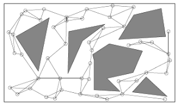

<!-- ## Planejamento de Trajetória -->

O planejador de trajetória é o algoritmo responsável por determinar o caminho que um robô deverá percorrer para se deslocar de uma posição inicial até uma posição final desviando de obstáculos. Essa funcionalidade é de extrema importância para a navegação autônoma, pois permite que o robô se desloque no seu espaço de operação sem a interferência de um operador humano.

Foi feita a implementação do algoritmo de planejamento de trajetória Probabilistic Roadmap (PRM) em um robô diferencial não-holonômico chamado Turtlebot3 para permitir a navegação autônoma desse robô. Os testes foram realizados em ambiente de simulação e em um labirinto real construído no laboratório do Senai Cimatec.

## Probabilistic Roadmap

O algoritmo Probabilistic Roadmap (PRM) é um planejador de trajetória que permite que um robô se desloque de um ponto inicial a um ponto final sem a interferência de um operador evitando a colisão com obstáculos.
O PRM é dividido em duas etapas, uma etapa de planejamento e uma etapa de questionamento. 

Na etapa de planejamento, são encontrados pontos aleatórios no mapa, verificando se esses pontos se encontram em espaços livres ou não, que são ligados uns aos outros por linhas retas, desde que não exista obstáculos entre eles. A medida que o número de pontos cresce, vão se formando possíveis rotas entre todos os espaços livres do mapa.

Na etapa de questionamento, é encontrada a trajetória do ponto inicial até o ponto final percorrendo as rotas que foram geradas na fase de planejamento com o menor custo possível. Uma vez que o mapa de rotas é gerado na fase de planejamento, o custo computacional para gerar uma nova trajetória se torna baixo, já que é necessário apenas realizar novamente a fase de questionamento.

Resumidamente, o PRM constrói um grafo G(V,A) em que V é o conjunto de vértices, que são os pontos livres encontrados aleatoriamente no mapa, e o conjunto A são as arestas que ligam os vértices vizinhos que não possuem obstáculos entre eles, como mostrado no gif.

<!-- {:.center}
 -->

  

 

## Turtlebot3

O Turtlebot3 é um robô diferencial não-holonômico desenvolvido pela empresa Robotis e tem como o ambiente de desenvolvimento padrão o ROS (Robot Operating System). O Turtlebot3 tem como unidade central de processamento uma Raspberry Pi e o sistema operacional instalado nela foi o Ubuntu 20.04 com o ROS Noetic. O modelo escolhido para esse desenvolvimento foi o Waffle Pi, que conta o motor DYNAMIXEL (XM430-W210-T) e uma câmera Raspberry Pi, componentes que o diferenciam do modelo Burger, além do seu  formato. O Turtlebot3 conta com um sensor de escaneamento a laser LiDar, uma OpenCR, módulo Bluetooth e uma beteria Li-Po. 

  

 

## Desenvolvimento

O tutorial de montagem e operação do Turtlebot3 está disponível no [link](https://emanual.robotis.com/docs/en/platform/turtlebot3/quick-start/). Foi instalada a imagem do Ubuntu 20.04 na Raspberry Pi, o ROS Noetic, as dependências necessárias e os pacotes do Turtlebot3 ros-noetic-dynamixel-sdk,ros-noetic-turtlebot3-msgs e o ros-noetic-turtlebot3.

Foi encontrado um pacote no GitHub no [link](https://github.com/mwswartwout/turtlebot_prm) que implementa o planejador PRM como Plugin no ROS. O pacote foi desenvolvido para outra versão de ROS, foram necessário fazer algumas modificações no mesmo e também instalar algumas dependências necessárias: occupancy_grid_utils, ros_noetic_tf2_bullet, ros_noetic_ompl e ros_noetic_ompl_dbgsym. Para selecionar o PRM como planejador global do Move Base é necessário alterar o parâmetro base_global_planner do pacote turtlebot3_navigation para o PRM. O algoritmo foi testado em ambiente de simulação (Gazebo) e também na prática, em um labirinto construído.

  

 

  

 

## Conclusão

O estudo realizado trouxe maior entendimento sobre as funcionalidades de planejamento de trajetória e navegação, além de trazer conhecimento sobre o funcionamento do planejador Probabilistic Roadmap. Em ambiente de simulação o planejador teve bons resultados, porém na prática, para algumas trajetórias mais complicadas, o planejador não conseguiu obter solução, mas conseguiu lidar bem com trajetórias simples. Alguns parâmetros do move_base podem ser ajustados para encontrar um melhor resultado da implementação do algoritmo. Para trabalhos futuros o serão implementadas os ajustes dos parâmetros e o resultado obtido com esse planejador será comparado com outros planejadores, como A\*, D\* e Dijkstra, para comparar seus resultados estatisticamente.

---------------------
 

<!-- autor -->

<h3 class="post-title">Autor</h3> 

  

    <table class="table-borderless highlight">
      <thead>
        <tr>
          <th></th>
        </tr>
      </thead>
      <tbody>
        <tr class="font-weight-bolder" style="text-align: center margin-top: 0">
          <td>Mateus Seixas</td>
        </tr>
        <tr style="text-align: center" >
          <td style="vertical-align: top"><small>Pesquisador em Robótica no Centro de Competências em Robótica e Sistemas Autônomos do Senai Cimatec. Graduado e mestrando em Engenharia Elétrica pela UFBA e amante da natureza.</small></td>
          <td></td>
        </tr>
      </tbody>
    </table>
  

 
