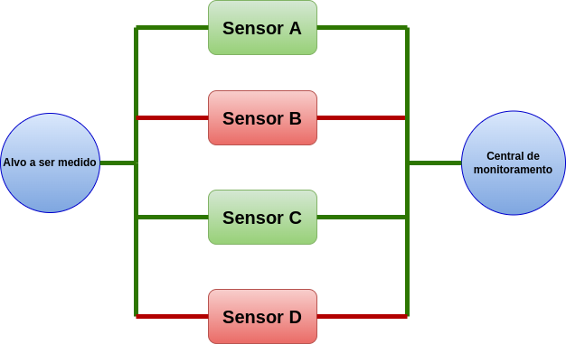
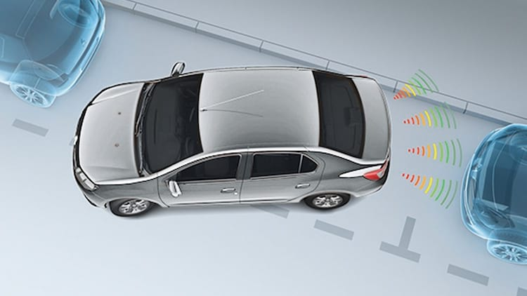
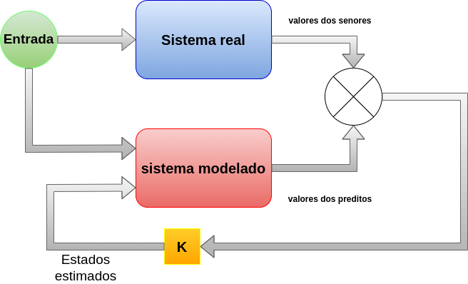
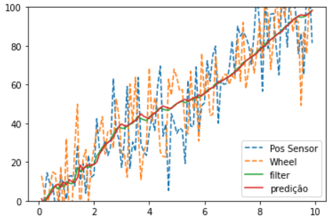

Nem sempre um único sensor consegue desempenhar a coleta de dados da forma desejada. Isso acontece por diversas razões: o sensor não consegue cobrir com acuracidade um grande intervalo de dados,  necessidade de haver uma pequena incerteza nas medições e dentre outras. Para atenuar essas dificuldades, técnicas de fusão de sensores, também chamada de fusão de dados, costumam ser aplicadas. O uso de mais de um sensor pode ser dividida em 5 objetivos:
* Aumento da confiabilidade;
* Aumento do tamanho de cobertura de medição;
* Realização de medidas indiretamente;
* Melhoria da qualidade do Sinal;
* Criação de novos dados.

### Aumento da Confiabilidade de Sistemas
Sensores podem ser implementados em sistemas para mensurar  dados que são importantes para a segurança.  Por exemplo, sensores são usados para mensurar a velocidade de turbinas de aviões. Os dados coletados pelos sensores são importantes para que os pilotos de aviões tenham conhecimento sobre a dinâmica do veículo aéreo. Se há apenas um sensor para uma turbina e este falha, os pilotos passam a não ter informação suficiente sobre o comportamento deste elemento. Para aumentar a garantia da continuidade da realização das medidas de um elemento, é comum implementar mais de um sensor sobre o mesmo alvo. Caso um sensor falhe, os outros devem continuar realizando as medições.
Em  um sistema, onde há 4 sensores, se dois destes falham  na coleta, os outros podem continuar a enviar os dados corretamente.

{:.center}

 

### Aumento do Tamanho da Cobertura de Medição

Algumas aplicações exigem a implementação de mais de um sensor  em razão da área e/ou região a ser tratada. Portanto, um conjunto de sensores podem ser usados para expandir a cobertura de medição. Um exemplo bastante comum  é nos sensores de estacionamento aplicados nos automóveis. Normalmente, 4 sensores são alocados na parte traseira dos veículos para detectar a presença de outros carros ou paredes.

Na robótica móvel, é comum aplicar mais de um sensor para identificar eventuais obstáculos que podem aparecer durante a navegação. Os robôs móveis de pequeno porte, ao exemplo do [Pioneer 3-DX](https://robots.ros.org/pioneer-3-dx/), possuem mais de um sonar para atingir uma cobertura de detecção suficiente para que nenhum obstáculo passe despercebido.
 

### Realização de  medidas indiretamente

 
Uma aplicação que a fusão de sensores pode ser encarregada é a medição de dados indiretamente, ou melhor,  estimação. Ainda não há tecnologia suficiente para realizar a medida da temperatura da cauda de um foguete, ou para medir o desgaste de pneus de carros de Fórmula 1, mas mesmo assim é possível obter uma estimação de como estes dados estão se comportando.
Se é possível obter a medição de alguns sensores de um sistema, a modelagem matemática destes sistemas, com o uso do filtro de Kalman, é possível  estimação destas variáveis, considerando que estas são
 [observáveis](https://en.wikipedia.org/wiki/Observability).
 
Os Filtros de Kalman são aplicados para realizar a estimação de estados, onde é considerado os dados do sistema real e sistema modelado. A partir do ganho K há um balanceamento entre estados mensurados e estimados. O ganho K é calculado em função da [covariância](https://en.wikipedia.org/wiki/Covariance) dos dados dos sistemas, menor a covariância, menor será o ganho atribuído.

{:.center}

 

### Criação de novos dados

Uma aplicação que usa  fusão e que está crescendo nos últimos anos é a mesclagem de novos dados. Nesta mesclagem, são usados dois ou mais dados com características distintas para obter um novo. Um bom exemplo é a aplicação  de câmeras digitais juntamente com LiDARes com a finalidade de criar uma nuvem  de pontos com as cores dos elementos. O LiDAR é responsável pela obtenção de informações sobre a geometria do ambiente em formato de nuvens de pontos e a câmera captura dados visuais. Com o uso de algoritmos de inteligência computacional, há uma fusão de dados e uma nuvem de pontos que possui dados sobre as cores pode ser gerada. O resultado da mesclagem pode ser usado criação de mapas 3D, imagens com dados de profundidade do ambiente, identificação de objetos e dentre  outros.

Um exemplo de uma aplicação de fusão de sensores para identificar objetos usando LiDAR e câmera  é apresentado neste [repositório](https://github.com/DGIST-ARTIV/Fusion-LiDAR-Camera). Nesta aplicação, os dados da câmera são fundidos com os dados do Lidar para identificar objetos que estão a uma distância média e longa de veículo autônomo. Apenas com dados visuais é possível identificar objetos que estão próximos, mas com o Lidar e usando  algoritmos de inteligência computacional, que permitem a realização da fusão, elementos que estão mais distantes dos veículo podem ser notados.

{:.center}

 
### Aumento da qualidade dos dados

 
Uma situação comum na robótica é quando apenas um único sensor não consegue mensurar corretamente os dados da odometria. Isso implica bastante na navegação autônoma, já que nesta situação as ações de controles são executadas com dados que não retratam muito bem a dinâmica.

Para contornar esse problema, a fusão de sensor é utilizada para melhorar a qualidade do sinal. O Filtro de Kalman, assim como sua versão para sistema não-lineares, o Filtro de Kalman estendido, melhoram a qualidade dos dados e os tornam mais próximos da realidade.

A figura abaixo apresenta uma aplicação de fusão de sensores, usando Filtro de Kalman, para melhorar os dados da medição da posição de um robô. O robô inicia o seu deslocamento na posição 0. Dois sensores são usados para realizar as medidas da posição do veículo. Os sensores são um encoder e um imu, na  legenda do gráfico são respectivamente: Wheel e Pos Sensor. A modelagem matemática do sistema realiza a predição, assim que o robô se desloca os sensores coletam os dados da posição do robô no ambiente e também fornece esta informação a modelagem do sistema. Os dados dos sensores possuem uma grande oscilação o que indica uma pequena covariância, enquanto os valores preditos pela modelagem são mais suaves. Neste caso, o valor filtrado vai considerar os dados da modelagem matemática mais do que os valores dos sensores.  Esta consideração é feita pelo ganho K do Filtro de Kalman.

{:.center}

 

Este gráfico está presente no [Notebook](https://colab.research.google.com/drive/1G0LTEOHRc8FBg3PAgu8uzaVPgPn1B5gd?usp=sharing) que apresenta uma breve introdução sobre Filtro de Kalman dedicado a fusão de sensores. Também há uma revisão sobre alguns conceitos sobre estatística, caso o leitor já sinta seguro e familiarizado sobre os conceitos, sugiro que pule esta parte.

As técnicas de fusão de sensores podem ser aplicadas para diversos fins. Desde o aumento da segurança de um sistema até as recentes aplicações voltadas para veículos autônomos. Para a robótica móvel, a fusão de sensores também pode ser usada para identificar objetos. Na navegação autônoma, a fusão de sensores apresenta um papel importante. Podendo ser realizada com o uso do Filtro de Kalman,  a fusão de dados possibilita a estimação da posição e orientação de  robôs móveis nos ambientes.  O leque de aplicações indicam a importância da fusão de sensores para a nossa atual sociedade.

 
<iframe src ="https://drive.google.com/file/d/1rhzWInXQev4B_oJt1n-9WmxWxP5TmhDy/preview" width='740' height='430' allowfullscreen mozallowfullscreen webkitallowfullscreen></iframe>

---------------------
 

<!-- autor -->
<table class="table-borderless highlight">

  <thead>

    <tr>

      <th></th>

    </tr>

  </thead>

  <tbody>

    <tr class="font-weight-bolder" style="text-align: center margin-top: 0">

      <td>Matheus Anselmo</td>

    </tr>

    <tr style="text-align: center" >

      <td style="color: #808080; vertical-align: top; text-align: justify"><small> Engenheiro de robótica  realizando pesquisa no Centro de Competências em Robótica e Sistemas Autônomos do Senai Cimatec. Matheus é formado em engenharia de controle e automação pela UFBA e autor da frase "um cafezinho sempre cai bem antes e depois de outro cafezinho"
      .</small></td>

      <td></td>

    </tr>

  </tbody>

</table>

