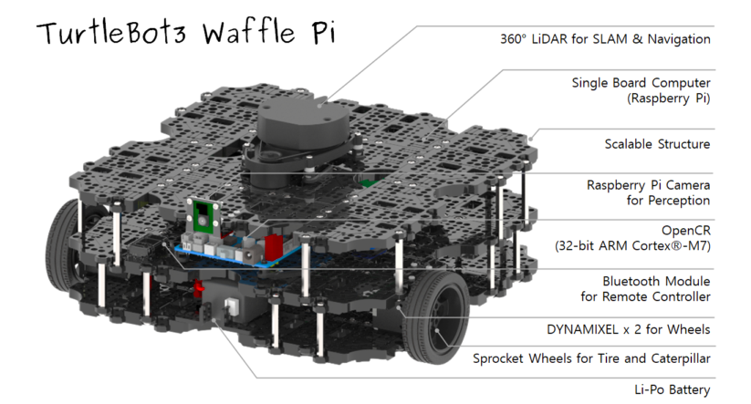
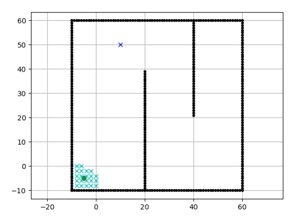
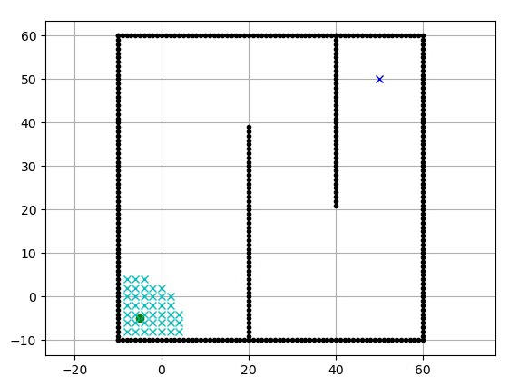
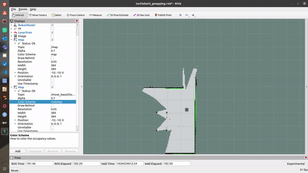

A navegação é uma funcionalidade importante para a robótica móvel. Esta funcionalidade, como o próprio nome já sugere, permite aos robôs móveis a capacidade de se deslocar em ambientes externos e internos. Comunalmente, a navegação pode ser realizada por teleoperação ou de forma autônoma. Na teleoperação, há necessidade de um humano realizar o controle de movimento dos robôs móveis, em outras palavras, por meio de um joystick ou um instrumento de comunicação, um operador  guia o robô. Na navegação autônoma, não há presença humana  no deslocamento do robô.
 
A navegação autônoma acontece quando alguma implementação lógica realiza todo o trabalho que seria executado por ações humanas. A implementação lógica costuma ser realizada através de algoritmos. Neste post será apresentado a navegação autônoma usando algoritmo Dijkstra no robô TurtleBot 3 Waffle Pi.

### Um pouco sobre o TurtleBot 3

{:.center}

O TurtleBot 3 Waffle Pi é um robô desenvolvido pela Robotis. É um robô de
pequeno porte, projetado para operar em locais internos
para fins educacionais. O sistema de sensoriamento do TurtleBot 3 possui uma câmera Raspberry Pi, lidar, imu e dois encoders. A atuação é desempenhada por dois servomotores. O robô também tem uma placa de processamento Raspberry Pi que é responsável pelos processamento da maioria dos algoritmos do robô. O TurtleBot 3 é desenvolvido para funcionar com o [ROS](https://www.ros.org)[^1], o que possibilita  a implementação de diversas  funcionalidades. O ROS detêm o pacote de software [move_base](http://wiki.ros.org/move_base) que permite a implementação da navegação autônoma de robôs diferenciais. O pacote move_base usa o algoritmo Dijkstra como padrão, mas outras lógicas podem ser implementadas. 

### Um pouco sobre o Algoritmo Dijkstra
 

O Algoritmo Dijkstra foi desenvolvido em 1956 e publicado em 1959 pelo cientista da computação [Edsger Dijkstra](https://www.computer.org/profiles/edsger-dijkstra). De acordo com , este algoritmo tem o objetivo de calcular a  menor trajetória entre dois vértices de um grafo em função do custo mínimo. Os vértices do grafo podem ser vistos como posições em plano 2D. Para as aplicações voltada para navegação de robôs autônomos, o custo da trajetória é a distância entre os vértices, ou seja, quanto menor é o percurso calculado, menor será o custo deste.

Tendo como a posição inicial da navegação o primeiro o vértice da busca, o algoritmo Dijkstra  calcula o custo mínimo para todos os demais. Quando o algoritmo alcança o vértice referente a posição final da navegação, é obtida a trajetória que será realizada pelo robô. Este algoritmo é bastante simples e além da navegação de robôs pode ser aplicado em tráfego urbano, sistemas ferroviário e Aéreos, rede de computadores e também pode ser o caminho para resolver vários problemas de logística.

Os gifs abaixo apresentam a aplicação desta técnica desenvolvida em Python por [Atsushi Sakai](https://iopscience.iop.org/article/10.1088/1757-899X/705/1/012037/pdf). Os pontos em azul são os vértices do grafo que já
foram explorados pelo algoritmo, e com isso os respectivos custos para alcançar estes já foram computados sempre considerando a menor distância.  Quando o ponto final da navegação é alcançado pelo algoritmo,  a  busca é finalizada e a trajetória do ponto inicial até este é gerada. Com a trajetória disponível, o sistema autônomo pode realizar o deslocamento até seu respectivo objetivo.

{:.center}

 

{:.center}

 
 

### Navegação
 
Agora  que o TurtleBot 3 e e o algoritmo Dijkstra já foram citados. Podemos falar da navegação que foi implementada. A aplicação foi realizada em dois tipos de ambientes: simulado e real. Na simulação, o robô inicialmente não conhecia o mapa. Para adquirir dados do mapa foi utilizada a técnica SLAM, que permite a criação de um mapa do ambiente e a obtenção da localização do robô de forma simultânea. Para esta implementação foi escolhida o SLAM que usa o algoritmo GMAPPING, que é uma aplicação de baixo custo computacional. Um exemplo da aplicação de SLAM usando o algoritmo GMAPPING é apresentado no projeto [APEREA](https://mhar-vell.github.io/rasc/2021-07-28-aperea-slam/). Como o SLAM fornece os dados do mapa, o sistema robótico passa a notar os possíveis obstáculos que podem esta presentes nos espaços espaços simulados e reais.
 
No ambiente real, o robô inicia a execução da navegação com o conhecimento do mapa. Os dados do mapa foram obtidos usando SLAM. Desta vez foi usado o pacote de software AMCL do ROS. O AMCl, Adaptive Monte Carlo Localization, é um técnica de localização probabilística dedicada a robôs que se deslocam em planos 2D. Esta técnica utiliza dados da localização do robô com os dados do mapa do ambiente. No TurtleBot, os dados de localização são obtidos por sensores per encoders e IMU. 

### Resultados
 
Na simulação e com auxílio do SLAM, o TurtleBot teve sucesso ao alcançar o objetivo. Vale considerar que nesta aplicação o robô não tem, inicialmente, nenhum conhecimento do ambiente.
 

{:.center}

 
 

No ambiente real e com auxílio da aplicação do AMCL, o robô também teve sucesso com a navegação. O TurtleBot enfrentou algumas dificuldades ao contornar os obstáculos. O Sucesso foi em razão da técnica AMCL usar o mapa completo do ambiente e assim o algoritmo Dijkstra pode obter a trajetória até o objetivo desde o momento inicial da navegação. As dificuldades para passar pelas extremidades podem ser atenuadas otimizando alguns parâmetros do pacote move_base.
 
{:.center}

 
 
A aplicação da navegação autônoma no TurtleBot 3 Waffle Pi foi bastante interessante já que esta funcionalidade é preciosa para a robótica, além de usar técnicas que são importantes para o desenvolvimento de sistemas autônomos móveis, ao exemplo do SLAM e do AMCL. Também vale notar que o algoritmo Dijkstra pode ser utilizados em UGV de médio e grande porte com sucesso. 

### O repositório

Este [link](https://github.com/Brazilian-Institute-of-Robotics/bir_turtlebot_expl-dijkstra) possui o workspace do desenvolvimento da navegação em um ambiente simulado. Este possui as informações para a instalações dos pacotes necessários realização do SLAM, AMCl, navegação autônoma e teleoperação utilizando um joystick.

[^1]: É o *Framework*  mais usado no desenvolvimento de sistemas robóticos.

 

### Referências



   

---------------------
<!-- autor -->

<h3 class="post-title">Autor</h3> 

  

    <table class="table-borderless highlight">

      <thead>

        <tr>

          <th></th>

        </tr>

      </thead>

      <tbody>

        <tr class="font-weight-bolder" style="text-align: center margin-top: 0">

          <td>Matheus Anselmo</td>

        </tr>

        <tr style="text-align: center" >

          <td style="color: #808080; vertical-align: top; text-align: justify"><small>Pesquisador Jr. em Robótica no Centro de Competências em Robótica e Sistemas Autônomos do Senai Cimatec. Matheus é formado em engenharia de controle e automação pela UFBA e autor da frase "um cafezinho sempre cai bem antes e depois de outro cafezinho".
          .</small></td>

          <td></td>

        </tr>

      </tbody>

    </table>

  

 

