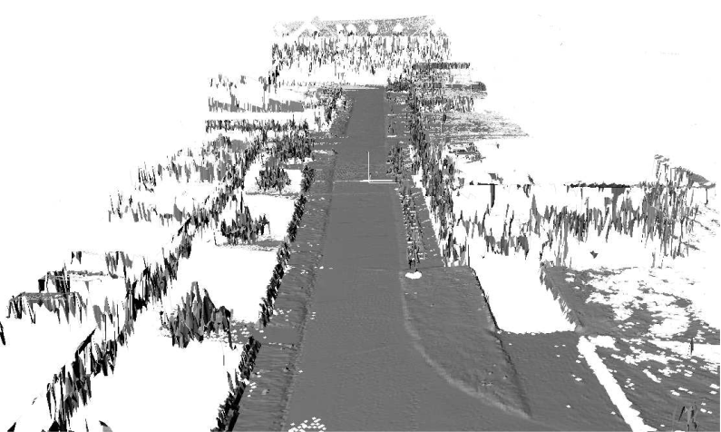
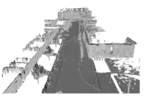

A Localização é  um quesito importante para robótica móvel, pois são com os dados da posição e orientação que as ações de controle são processadas. Em uma situação em que os dados da localização não refletem muito bem  a dinâmica, a atuação pode ser prejudicada principalmente quando a navegação é realizada de forma autônoma.

Em ambientes internos e controlados, o uso de técnicas como SLAM ajuda os robôs na obentação de dados sobre a posição e orientação. Em ambientes externos nem sempre é possível obter dados da posição usando esta técnica. Uma solução para realizar a localização em ambientes externos é apresentada por [ Rainer K.](https://www.linkedin.com/in/rainer-k%C3%BCmmerle-256b4a15a/?originalSubdomain=de), [Rudolph T.](https://www.linkedin.com/in/rudolph-triebel-82107713/), [Patrick p.](https://www.linkedin.com/in/patrick-pfaff-97a51b9/) e [wolfram B.](https://www.linkedin.com/in/burgard/) no artigo [Monte Carlo Localization in Outdoor Terrains Using Multi-Level Surface Maps](https://www.researchgate.net/publication/220648287_Monte_Carlo_Localization_in_Outdoor_Terrains_Using_Multi-Level_Surface_Maps) que demonstra a aplicação do Monte Carlo localization com auxílio de mapas multi-níveis e compara os resultados obtidos com mapa de elevação.

Em ambientes externos, é comum usar GPS para obter dados sobre a posição dos robôs, porém o sinal deste pode ser prejudicado pela presença de árvores, muros, paredes e dentre outros anteparos. Estes elementos podem atuar como obstáculos para o sinal do GPS. Uma solução para contornar este problema é usar  o Monte carlo Localization juntamente com Mapas de múltiplas camadas.  Geralmente para realizar a localização de robôs são usados os Mapas de elevação 2,5 D.

 

## Mapa de Elevação

Os mapas de elevação, comunalmente chamados de mapas 2,5 D, são formados pela projeção de informações de profundidade de elementos verticais em plano 2 D, em outras palavras, os objetos e obstáculos que estão situado em local são usados para criar o plano horizontal de um mapa. Nestes mapas, os dados do plano são coletados e bem representados, mas as elevações são processadas como um média dos dados verticais de ua região.

#### Mapa de Elevação

 

## Mapa de Multi-Níveis

Os Mapas de multi-níveis, além representar bem o plano, consegue representar os dados verticais devido ao uso de representação em camadas. Os dados geométricos verticais dos mapas multi-níveis são usados para estimar a posição do robô, em outras palavras, o plano vertical e horizontal servem para obter a localização. Os mapa de multi-níveis também oferecem dados sobre a posição do robô quanto ao eixo vertical, o eixo z. Um outro detalhe importante é que o custo computacional do mapa de multi-nível  é  apenas 10% maior em comparação ao mapa de elevação, em outras palavras, há um pequeno aumento no uso de hardware. Os dados do mapas de Multi-Níveis são  fornecidos para o algortimo de Monte Carlo Localization.

## Monte Carlo Localization

Antes de falar sobre o monte carlo Localization, vamos fazer uma breve notação sobre probalidade condicional. O termo  $ Pr(A|B) $ indica probalidade do evento **A** ser realizado considerando que o evento **B** foi executado primeiramente.

O Monte Carlo Localization (MCL) é um algoritmo destinado a sistemas robóticos com o objetivo de obter dados sobre a posição e orientação do robô no ambiente. Este algoritmo usa um filtro de partículas, para posição e orientação, e um mapa do ambiente para realizar a estimação. Cada partícula representa uma possível localização  o robô pode apresentar. As partículas são estimadas usando um filtro Bayesiano recursivo. Geralmente são usados mapas de elevação para abastecer de dados o Monte Carlo Localization. A ideia chave do Monte Carlo Localization é manter a probabilidade constante:

  
 $$  Pr(x_t | z_{1:t},u_{0:t-1} ) $$

onde $ x_t $ é probabilidade do  evento $ x_n $ acontecer no  momento $ t $  considerando os dados dos sensores desde da primeira medida  $ z_{1:t}$ e dados de entrada do sistema  desde do momento inicial até o último $ t-1 $ $,u_{0:t-1}$. Cada evento $ x_t $  corresponde a uma pose que o robô pode assumir no ambiente. O Monte Carlo Localization  utiliza dois modelos: um destinado a predição do sistema e um outro focado no sensoriamento.

Na predição é aplicado a modelagem matemática do sistema que considera os valores da posição do robô com os valores de entrada dos sistema. No sensoriamento, também nomeada como correção, os dados da localização através de sensores são usados para ajustar o conhecimento que foi obtido durante a predição. Os mapas de multi níveis são usados tanto no modelo predição quanto quanto no de senseriamento.

No modelo de predição, a posição que obtida por essa fase é projetada do no mapa 3D. Com isso a localização do robô passa a considerar  o eixo Z. Para cada região do mapa há uma adequação quanto a posição do robô no eixo Z.  Esta adequação é realizada porque que cada região do mapa detêm uma informação fixa quanto a posição do eixo z. Por exemplo, se na região A o, valor de z é de 10 cm em relação a referência do mapa, o robô ao atingir esta região do mapa irá estara com com valor de 10 cm. 

O modelo de sensoriamento que foi implementando é baseado no Likelihood Fields que foi desenvolvido e introduzido pelo ciêntista da computação [Sebastian Thrun](http://robots.stanford.edu/) em 2001. O modelo sensoriamento ultiza um laser para estimação da localização do robô .Com os dados sobre a distância pecorrida pelos raios da fonte emissora, este modelo consegue ter uma percepção da localização.  Esta percepção é retratada de uma forma simplificada como:  

 $$  Pr(z | x ) =\alpha_{hit}*Pr_{hit}(z | x ) +\alpha_{rand}*Pr_{rand}(z | x ) + \alpha_{max}*Pr_{max}(z | x ) $$

Onde o $ Pr_{hit} $ obtêm informações quando algum obstáculo é notado, medidas randômicas e algumas inperfeições são consideradas com o $ Pr_{rand} $ e para considerar o limite de alcance do laser é usado na equação. Os fatores $ \alpha_{hit} $, $ \alpha_{rand} $ e $ \alpha_{max} $ são determinados empiricamente e são usados para garantir que a soma  das probabilidades do robô está alocado nas  posíveis localizações seja igual à 1.

Com o $ Pr_{hit} $  que considera os obstáculos do ambiente, é possivel obter a distância e o ângulo entre o anteparo mais próximo o do robô.Com estes dois dados torna possivél a estimação da posição e orientação do robô.

## Resultados 

O uso do Monte Carlos Localization com o mapa de multi-nível apresentou uma melhor representação da posição do robô em comparação ao mapa de elevação. Esta estratégia pode ser uma excelente opção em ambientes externos onde o nem sempre o sinal do GPS está disponível. Assim como aponta  a figura abaixo, com apenas 10 etapas de resampling, a estratégia que usou oa mapas multi-nível já se aproxima bastante do de acuricidade de 100%. Resampling é o evento na qual as particulas d elocalização são geradas.

 

## Mapa Conceitual

Um mapa conceitual foi realizado para compreender melhor o artigo através de ligações gráficas. As ligações gráficas representam as conexões entre os principais  conceitos que compõem o material.

 

O Monte Carlo Localization in Outdoor Terrains Using Multi-Level Surface Maps é um excelente artigo. A leitura e a interpretação deste material, juntamente com a montagem do mapa conceitual são válidos para adquirir conhecimentos sobre a localização sobre robótica móvel. A questão sobre a localização é bastante importante para o desenvolvimento e aplicação de sistemas autônomos móveis, já que estes estão ganhando cada vez mais funcionalidades e expandindo as áreas de atuações. Além de propor uma solução para a localização em ambientes externos com baixo custo computacional, este  material faz uso de ferramentas estatística que além de serem fortemente utilizado na robótica são bastantes importantes para outras áreas. 

 

 

---------------------
<!-- autor -->

<h3 class="post-title">Autor</h3> 

  

    <table class="table-borderless highlight">

      <thead>

        <tr>

          <th></th>

        </tr>

      </thead>

      <tbody>

        <tr class="font-weight-bolder" style="text-align: center margin-top: 0">

          <td>Matheus Anselmo</td>

        </tr>

        <tr style="text-align: center" >

          <td style="color: #808080; vertical-align: top; text-align: justify"><small> Engenheiro de robótica  realizando  no Centro de Competências em Robótica e Sistemas Autônomos do Senai Cimatec. Matheus é formado em engenharia de controle e automação pela UFBA e autor da frase "um cafezinho sempre cai bem antes e depois de outro cafezinho"
          .</small></td>

          <td></td>

        </tr>

      </tbody>

    </table>

  

 

