A cinemática é o estudo mais básico de como os sistemas mecânicos se comportam. É conhecida como a ciência do movimento e trata do assunto sem considerar as forças que o causam. 

Os robôs manipuladores são muito utilizados nas indústrias devido as suas diversas funcionalidades como para o manuseio de materiais, soldagem e montagem, sendo empregados em ambientes de alto risco ou em atividades que exigem precisão, como cirurgias. A cinemática, quando falamos de manipuladores, refere-se a todas as propriedades do movimento que sejam geométricas e baseadas no tempo.

A cinemática direta tem como informação os ângulos das juntas e busca calcular a posição e orientação do end-effector do manipulador. Enquanto, a cinemática inversa tem um objetivo mais complexo, que é encontrar os ângulos das juntas dada uma pose (posição e orientação) para o end-effector (efetuador).

{:.center}

A cinemática inversa soluciona uma das tarefas ou aplicação mais importantes quando estamos falando de manipuladores ou robôs articulados, que é o de possibilitar o robô atingir as posições e orientações desejadas. Além disso, permite encontrar os valores exatos dos ângulos das juntas que levarão a esta pose, tendo em vista que não há uma relação direta entre a posição do end-effector e uma junta em particular. 

Para mais informações à respeito do planejamento de trajetória de um manipulador veja este [post](https://mhar-vell.github.io/rasc/2021-09-01-doe-aum/) sobre o UR5.

{:.center}

O nosso objetivo é compreender os fundamentos da cinemática inversa, com isso, o primeiro passo para aplicar os métodos de solução é atribuir um sistema de referência aos elos do manipulador. Para então atribuir os parâmetros de Denavit-Hartenberg (DH) para o sistema e, então construir matrizes homogêneas e realizar a transformação de referências. Por fim, são aplicados os métodos de solução, no nosso caso iremos abordar os métodos geométrico e o algébrico para então encontrarmos as equações.

{:.center}
[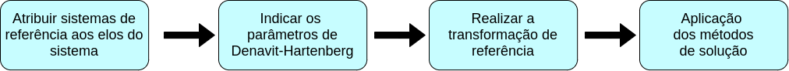](../assets/img/mini-curso-ik/esquematico.png)

 

# Descrições mecânicas

Precisamos entender o comportamento mecânico do robô para sermos capazes de projetá-lo adequadamente. No caso dos manipuladores eles são compostos por diferentes partes. As quais são:

* **Elos**: São os corpos rígidos que ficam localizados entre as juntas;
* **Juntas**: Conectam dois ou mais elos. São responsáveis pelo movimento entre elos que estão conectados;
* **Efetuador**: Fica localizado na parte livre da cadeia de elos do manipulador. É onde são acopladas as ferramentas que o robô utiliza para sua aplicação;
* **Base**: Fica na parte inferior do robô e, é resposável por fixar o robô em alguma estrutura;
* **Actuadores**: Proporcionam os movimentos das juntas do robô;
* **Sensores**: São utilizados para coletar informações sobre o estado interno do robô e sobre o ambiente.

{:.center}
[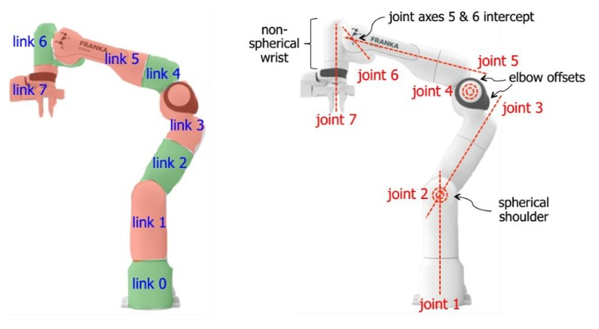](../assets/img/mini-curso-ik/manipulator-caracteristics.png)

 

A mobilidade de um sistema mecânico pode ser classificada de acordo com o número de graus de liberdade que o sistema possui. A figura mostra um lápis deitado sobre uma folha de papel plana com um sistema x, y de coordenadas. Considerando a posição deste lápis sobre este plano, são necessários 3 parâmetros para definir completamente sua posição na folha: 2 coordenadas lineares (x,y), para definir a posição de qualquer ponto do lápis, e uma coordenada angular ($\theta$), para definir o ângulo do lápis com relação aos eixos. Portanto, este sistema possui 3 graus de liberdade.

{:.center}
[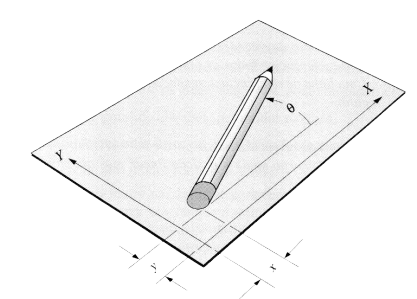](../assets/img/mini-curso-ik/gdl.png)

Já em um sistema 3D são necessários 6 parâmetros para definir os 6 graus de liberdade. Comumente são utilizadas as coordenadas x, y, z para o movimento de translação e alguma convenção de ângulos, como os ângulos de Euler, para os movimentos de rotação sobre os eixos.

O corpo rígido tem 6 graus de liberdade no espaço, entretanto devido a algumas restrições ocasionadas por suas ligações, pelo menos um dos graus de liberdade é perdido. Um exemplo disso são os movimentos dos membros de um braço humano que possuem restrições conforme a sua conexão, perdendo assim alguns graus de liberdade na sua movimentação.

{:.center}
[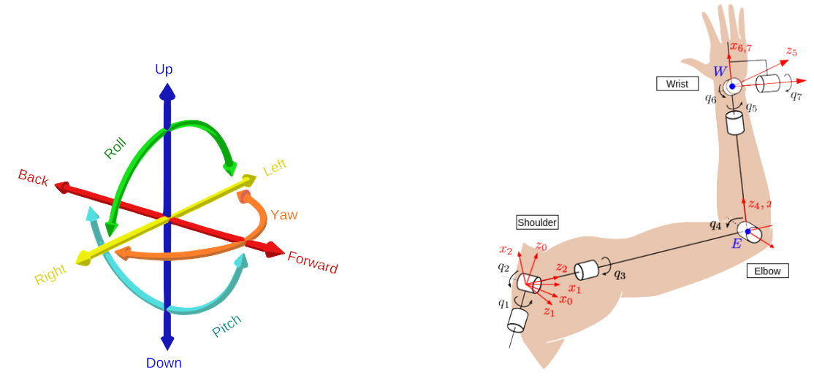](../assets/img/mini-curso-ik/gdl2.png)

Existem 6 tipos de juntas conhecidas como par inferior, as quais são juntas com superfície de contato.

{:.center}
[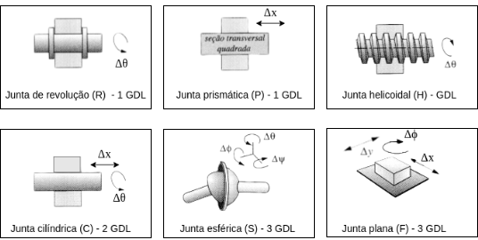](../assets/img/mini-curso-ik/juntas.png)

Os tipos de juntas mais utilizadas nos manipuladores são as juntas de revolução (rotacionais) e as juntas prismáticas (transversais).

Uma das aplicações destes conceitos está na implementação do URDF (Unified Robot Description Format), o qual é um arquivo em XML que permite a construção do modelo do robô, a partir da descrição do seu funcionamento e estrutura com base nas conexões dos seus elos e juntas, utilizando arquivos CAD para gerar a parte visual. Este [post](https://mhar-vell.github.io/rasc/2021-07-21-aperea-simulacao/) apresenta mais detalhes a respeito da configuração do URDF em um projeto.

# Descrições espaciais e transformações

A manipulação robótica envolve peças e ferramentas que fazem parte do ambiente de trabalho do robô e portanto é necessário representar a sua posição e orientação no espaço por meio de coordenadas, assim como considerar um sistema de coordenada de referência para analisar a relação entre as partes do robô e estes objetos.

Com relação a posição podemos localizar qualquer ponto no espaço com um vetor posição 3x1 indicando os vetores unitários em cada um dos eixos do sistema de coordenada.

{:.center}
[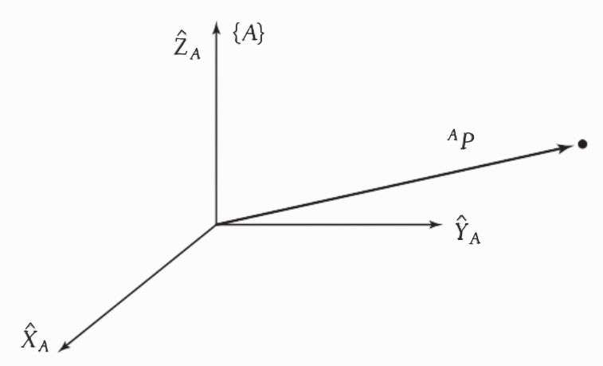](../assets/img/mini-curso-ik/position.jpeg) 

$$ 
_{}^{A}\textrm{P} = 
\begin{bmatrix} 
  p\_{x}\\ p\_{y}\\ p\_{z}\\ 
\end{bmatrix} 
$$                     

 

Para descrever a orientação de um ponto utilizamos uma matriz 3x3, denominada de matriz rotacional. Considerando uma coordenada {B} fixa a ponta do manipulador, escrevemos os vetores unitários de seus 3 eixos principais em termos do sistema de coordenadas {A}.

{:.center}
[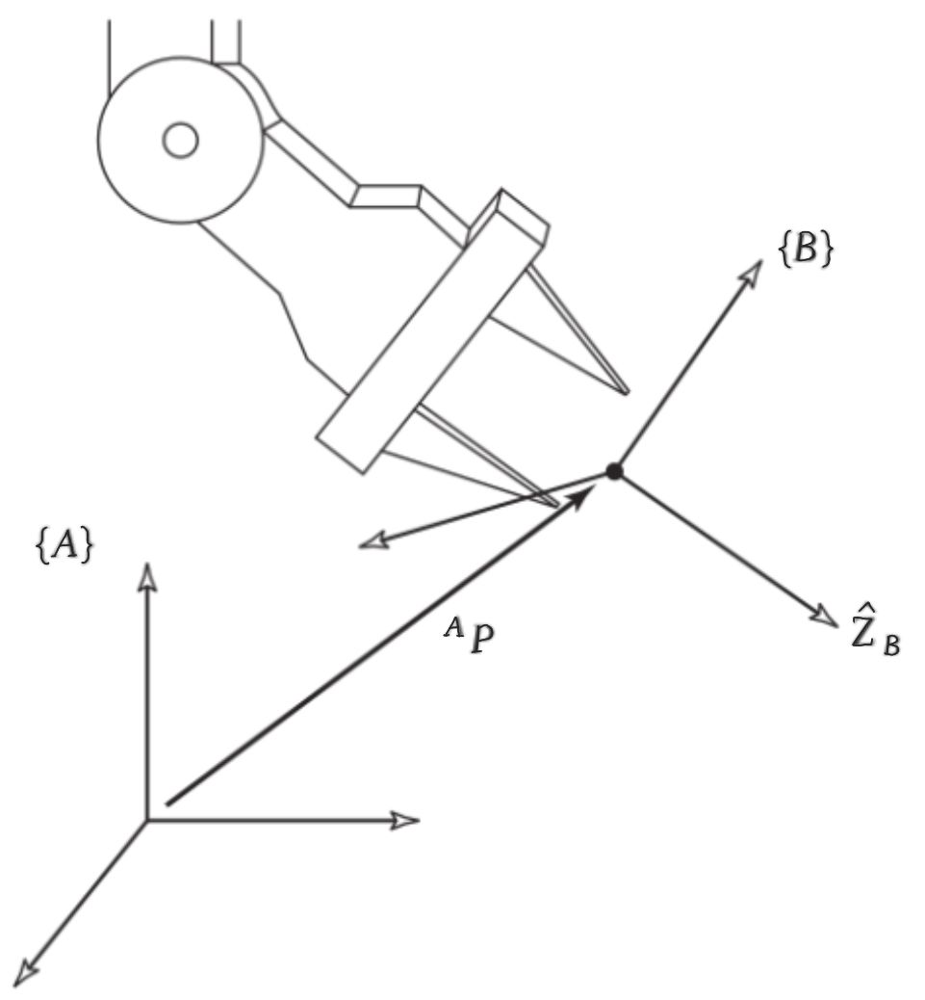](../assets/img/mini-curso-ik/orientacao.jpeg)

$$ \_{B}^{A}\textrm{R} = 
\begin{bmatrix}
  _{}^A\hat{X}_B & _{}^A\hat{Y}_B  & _{}^A\hat{Z}_B 
\end{bmatrix} 
= 
\begin{bmatrix} 
  r\_{11} & r\_{12} & r\_{13}\\ r\_{21} & r\_{22} & r\_{23}\\ r\_{31} & r\_{32} & r\_{33}\\
\end{bmatrix} $$

 

O sistema de referência é um conjunto de 4 vetores que fornecem a posição e a orientação. Eles são usados para descrever um sistema de coordenadas em relação a outro. Por convenção são atribuídos alguns nomes e localizações específicos a certos sistemas de referência associados ao robô e ao seu espaço de trabalho conforme a figura na qual estes pontos são:

* **Sistema de referência da base {B}**: Está fixado a uma parte imóvel do robô (elo 0);
* **Sistema de referência da estação {S}**: Está fixo em um local relevante para a tarefa;
* **Sistema de referência do punho {W}**: Está fixo ao último elo do manipulador;
* **Sistema de referência da ferramenta {T}**: Está fixado à ponta de qualquer ferramenta que o robô esteja utilizando e quando não é utilizada uma ferramenta este é fixo com a origem entre as pontas dos dedos do robô;
* **Sistema de referência da meta {G}**: Está no local onde o robô deverá alcançar, o seu objetivo.

{:.center}
[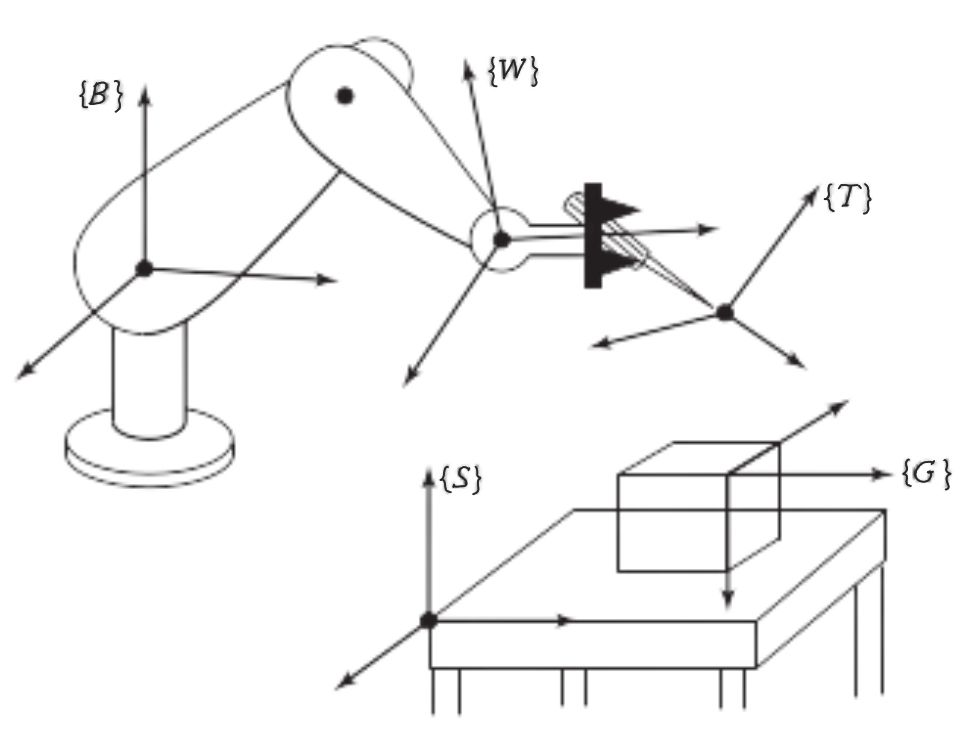](../assets/img/mini-curso-ik/referencial.jpeg)

A transformação homogênea corresponde a uma matriz 4x4 que dispõe a rotação e a translação geral na forma de uma única matriz e também é utilizada para descrever os sistemas de referência. Desta forma, é feito o mapeamento de um sistema de referência para outro como um operador em forma de matriz.

# Cinemática

Retornando a falar sobre a cinemática...

Conforme mencionado anteriormente, a cinemática direta determina onde o end-effector vai estar posicionado, considerando também sua orientação, se as juntas forem especificadas em uma posição definida. As equações da cinemática direta podem ser definidas através de uma abordagem sistemática e geral baseada na álgebra linear, utilizando as transformações homogêneas associada aos parâmetros de Denavit- Hartenberg.

Os parâmetros de Denavit-Hartenberg ou DH são 4 parâmetros associados a uma convenção particular, a qual relaciona frames de referências aos elos de uma cadeia cinemática.

{:.center}
[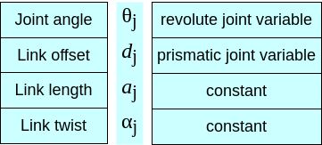](../assets/img/mini-curso-ik/para.png)

Esta convenção foi desenvolvida por Jacques Denavit, o qual era doutor em Engenharia mecânica e tinha bastante interesse pela área principalmente em relação a cinemática e a dinâmica. 
E, por Richard Hartenberg que lecionou na área da Engenharia mecânica por cerca de 56 anos e desenvolveu diversas pesquisas, o que influenciou o renascimento do interesse de outros pesquisadores por essa área.

{:.center}
[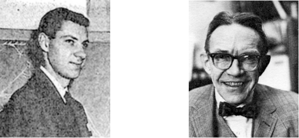](../assets/img/mini-curso-ik/DH.png)

Esta notação provê uma metodologia padrão para escrever as equações de um manipulador onde os parâmetros de elo são definidos da seguinte maneira: 

{:.center}
$\theta_{i}$ $\rightarrow$ o ângulo de $\hat{X}\_{i-1}$ a $\hat{X}\_{i}$ medida ao longo de $\hat{Z}\_i$

{:.center}
$d_{i}$ $\rightarrow$ a distância de $\hat{X}\_{i-1}$ a $\hat{X}\_{i}$ medida ao longo de $\hat{Z}\_i$

{:.center}
$a_{i}$ $\rightarrow$ a distância de $\hat{Z}\_{i}$ a $\hat{Z}\_{i+1}$ medida ao longo de $\hat{X}\_i$

{:.center}
$\alpha_{i} \rightarrow$ o ângulo de $\hat{Z}\_{i}$ a $\hat{Z}\_{i+1}$ medida ao longo de $\hat{X}\_i$

 

{:.center}

Podemos calcular as transformações individuais para cada elo, conforme a matriz homogênea que é composta por variáveis definidas a partir dos valores dos parâmetros de Denavit-Harteberg atribuidos ao sistema.

{:.center}
$$ _{}^{n-1}{T}\_n = \begin{bmatrix} \cos{\theta\_{n}} & -\sin{\theta\_{n}} & 0 & a\_{n-1}\\ \sin{\theta\_{n}}\cos{\alpha\_{n-1}} & \cos{\theta\_{n}}\cos{\alpha\_{n-1}} & -\sin{\alpha\_{n-1}} & -d\_{n}\sin{\alpha\_{n-1}}\\ \sin{\theta\_{n}}\sin{\alpha\_{n-1}} & \cos{\theta\_{n}}\sin{\alpha\_{n-1}} & \cos{\alpha\_{n-1}} & d\_{n}\cos{\alpha\_{n-1}}\\ 0 & 0 & 0 & 1 \end{bmatrix} $$

 

E, então as transformações de um elo a outro pode ser feita por meio do produto matricial resultando nas equações básicas para a análise cinemática do manipulador.

Na cinemática indireta calculamos os valores dos ângulos das juntas dada a pose para o efetuador do robô. Desta forma, são feitas as transformações para encontrar a transformação que define o sistema de referência do punho {W} em relação ao sistema de referência da base {B}. 

A complexidade da cinemática inversa está na resolução das equações cinemáticas por serem não lineares. Portanto, temos que nos preocupar com a existência de soluções, visto que para que uma solução exista a posição alvo deve estar dentro do espaço de trabalho do manipulador. E, também podem existir múltiplas soluções, o que configura-se como um desafio pois o sistema deve escolher apenas uma das soluções.

Existem diversos métodos para a resolução da cinemática inversa. As estratégias de soluções podem ser divididas em 2 categorias amplas:

* **Soluções de forma fechada**: São baseadas em expressões analíticas ou na solução de um polinômio de grau 4 ou menor, de forma que cálculos não iterativos são suficientes para chegar a uma solução. Ex: Método algébrico, método geométrico, solução de Pieper;
* **Soluções em forma aberta**: São soluções numéricas iterativas e por isso são muito mais lentas em comparação com a forma fechada. Ex: Métodos numéricos. 

 

## Prática 1 - Resolução questão no Google Colab

O primeiro desafio deste mini-curso é a resolução de uma questão que envolve todos os conceitos aprendidos e são aplicados os métodos algébrico e geométrico. Este exercício pode ser acessado neste [arquivo](https://drive.google.com/file/d/1F6f_zmpNl0TTneYwa_k1d7ryoSmsrePu/view?usp=sharing) do Google Colab, o qual é um ambiente de desenvolvimento Python executado no navegador usando Google Cloud.

{:.center}

Bibliotecas utilizadas:

* **SymPy**: É uma biblioteca Python para matemática simbólica;
* **Math**: É um módulo integraado que fornece uma série de métodos e constantes matemáticas.

## Solucionadores

Existem vários métodos de modelagem e soluções de problemas de cinemática inversa. E, todos eles possuem alguns pontos positivos e negativos que devem ser avaliados e selecionados de acordo com a aplicação. 

Um exemplo de solucionador é o MoveIt, o qual é um pacote do ROS utilizado por diversas empresas. Este pacote possui funcionalidades como realizar o cálculo da cinemática inversa, fazer o planejamento de trajetórias e verificar a presença de obstáculos.

{:.center}
[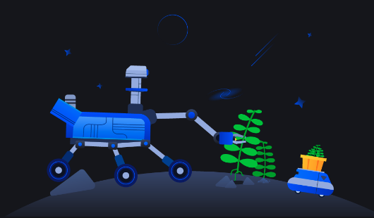](../assets/img/mini-curso-ik/MOVEIT.png)

 

## Prática 2 - Simulação no CoppeliaSim

A segunda prática deste mini-curso é a configuração de um manipulador no software CoppeliaSim. O software deve ser instalado através deste [link](https://www.coppeliarobotics.com/downloads), a versão utilizada é a educacional. Após o download do software siga as instruções deste [tutorial](https://www.coppeliarobotics.com/helpFiles/en/inverseKinematicsTutorial.htm).

{:.center}
[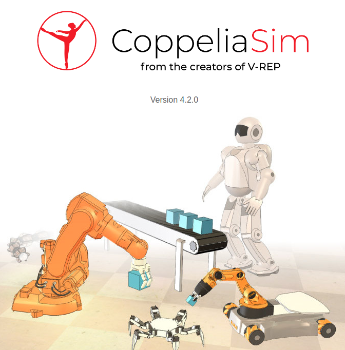](../assets/img/mini-curso-ik/v-rep.png)

O script disponibilizado no simulador apresenta 2 métodos de soluções para a cinemática inversa, onde ambos consideram a matriz jacobiana para definir a trajetória do manipulador, uma análise que está relacionada com a dinâmica. Caso tenha interesse em saber mais sobre trajetória dinâmica dos manipuladores, recomendo a leitura deste [post](https://mhar-vell.github.io/rasc/2021-06-19-trajetoria-dinamica/).

 

## Considerações finais

Este mini-curso apresentou os principais conceitos relacionados com a análise cinemática de um sistema de manipuladores e alguns dos procedimentos para encontrar as equações cinemáticas do sistema. 

Estes procedimentos envolvem a descrição dos mecanismos por meio dos parâmetros de Denavit-Hartenberg, a transformação de um sistema de referência para outro através das matrizes homogêneas e a utilização dos métodos algébrico e geométrico para encontrar as equações da cinemática inversa de um manipulador simples. 

Estes conceitos foram colocados em prática durante a atividade no Google Colab, enquanto que a atividade com  o CoppeliaSim complementa o aprendizado colocando em prática outros conhecimentos adquiridos, porém em um ambiente de simulação. Inclusive, este software apresenta diversos modelos de robôs manipuladores. Recomendo explorá-lo para conhecer os diversos tipos disponíveis. 

<iframe src = "https://drive.google.com/file/d/1OYpyLJfsIrkP8Lt4HiOZhbJuJXMybuVM/preview" width='740' height='430' allowfullscreen mozallowfullscreen webkitallowfullscreen></iframe>

# Referências

1. Craig, John J. **Robótica**. 3ª edição, 2012. 
2. NORTON, Robert L. **Cinemática e dinâmica dos mecanismos**. AMGH Editora, 2010.

* * *
 

<!-- autor -->

<h3 class="post-title">Autor</h3> 

  

    <table class="table-borderless highlight">
      <thead>
        <tr>
          <th></th>
        </tr>
      </thead>
      <tbody>
        <tr class="font-weight-bolder" style="text-align: center margin-top: 0">
          <td>Juliana Santana</td>
        </tr>
        <tr style="text-align: center" >
          <td style="color: #808080; vertical-align: top; text-align: justify"><small>Pesquisadora em Robótica no Centro de Competências em Robótica e Sistemas Autônomos do Senai Cimatec. Motivada por desenvolver projetos que possam fazer a diferença. Juliana é formada em engenharia elétrica pelo Centro Universitário SENAI Cimatec. </small></td>
          <td></td>
        </tr>
      </tbody>
    </table>
  

 

