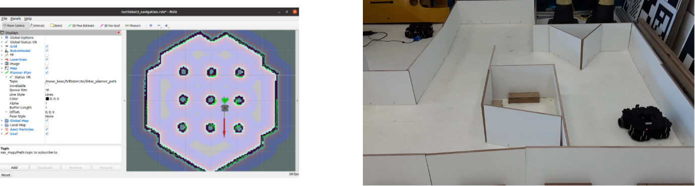

O D\* é um algoritmo de exploração capaz de gerar trajetórias baseando-se em informações iniciais conhecidas do ambiente e em informações estimadas. Posteriormente, de forma incremental, ele ajusta o caminho conforme as informações sobre o ambiente são obtidas.

Diferentemente de outras metodologias, o D* ao realizar um replanejamento não realiza mudanças desde o início, desta forma somente as porções mais próximas da trajetória gerada são modificadas. Por isso, o D* é muitas vezes mais rápido e tem a capacidade de gerar um caminho otimizado em tempo real. E, funcionalmente, é equivalente a replanejar desde o início.

{:.center}

O método D\* pode ser classificado em D\* original, D\* focado e D\* lite. O D\* original  foi introduzido por Anthony Stentz em 1994. E, o seu nome tem como base o termo "Dynamic A\*", pois o algoritmo se comporta como o A\*, exceto que os custos do arco podem mudar à medida que o algoritmo é executado. O D\* focalizado  também foi desenvolvido por Stentz e foi derivado do D\* original possuindo como diferencial o foco no reparo da trajetória reduzindo significadamente o tempo total necessário para calcular e realizar as operações seguintes.

Enquanto, o D\* lite , desenvolvido por Sven Koenig e Maxim Likhachev, tem como base a estratégia do Lifelong Planning A\*. Este método implementa o mesmo comportamento do método D\* Focalizado mas o seu algoritmo é diferente. É, um algoritmo mais fácil de entender e analisar e pode ser implementado com uma menor quantidade de linhas de código. Devido a essas características, os sistemas atuais são normalmente baseados no D\* lite.

{:.center}

Por isso, o plugin desenvolvido utiliza o método D\* lite. Ele funciona no ROS Kinetic e é compatível com o TurtleBot3. É capaz de gerar uma trajetória global e apresenta bons resultados em curtas distâncias. 
Os testes iniciais e configurações do pacote foram realizados no ambiente de simulação. E, após o seu funcionamento foram feitos testes no robô real em um ambiente de labirinto. 

{:.center}

O pacote ainda precisa de algumas correções para que forneça bons resultados em todas as situações, pois apresenta algumas incosistências para gerar trajetórias. Nas próximas fases será feita a implementação deste projeto utilizando o ROS 2 e serão feitos testes estatísticos comparando o desempenho do D* com as versões padrões do ROS e outras versões de algoritmos de exploração como o PRM. E, a sua junção com outras metodologias como o RRT. 

<!-- %//todo: Colocar vídeo -->

Para mais detalhes à respeito do desenvolvimento do projeto recomendo a leitura do [relatório](https://github.com/Brazilian-Institute-of-Robotics/bir_turtlebot_expl-d-star/tree/relatorio). O pacote com o plugin do D* lite está disponível neste [repositório](https://github.com/Brazilian-Institute-of-Robotics/bir_turtlebot_expl-d-star/tree/main).

## Referências



 
 

* * *

<!-- autor -->

<h3 class="post-title">Autor</h3> 

  

    <table class="table-borderless highlight">
      <thead>
        <tr>
          <th></th>
        </tr>
      </thead>
      <tbody>
        <tr class="font-weight-bolder" style="text-align: center margin-top: 0">
          <td>Juliana Santana</td>
        </tr>
        <tr style="text-align: center" >
          <td style="color: #808080; vertical-align: top; text-align: justify"><small>Pesquisadora em Robótica no Centro de Competências em Robótica e Sistemas Autônomos do Senai Cimatec. Motivada por desenvolver projetos que possam fazer a diferença. Juliana é formada em engenharia elétrica pelo Centro Universitário SENAI Cimatec. </small></td>
          <td></td>
        </tr>
      </tbody>
    </table>
  

 