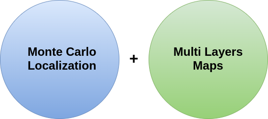
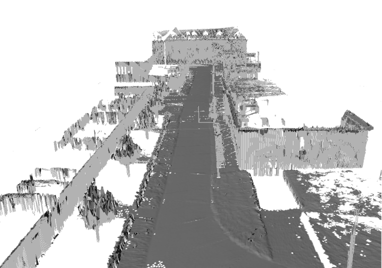
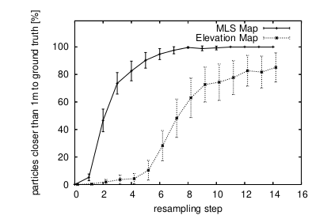
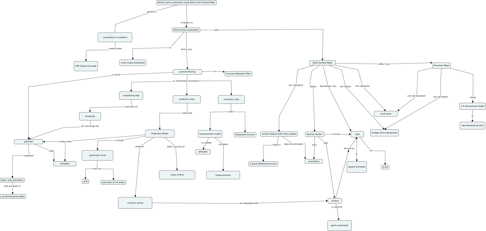

A localização é  um quesito importante para robótica móvel, pois são com os dados da posição e orientação que as ações de controle são processadas. Em uma situação em que os dados da localização não refletem muito bem  a dinâmica do robô, a atuação pode ser prejudicada principalmente quando a navegação é realizada de forma autônoma.

Em ambientes internos e controlados, o uso de técnicas como SLAM ajuda os robôs na obtenção de dados sobre a posição e orientação. Em ambientes externos, nem sempre é possível obter dados da posição usando esta técnica. Uma solução para obter a localização em ambientes externos é apresentada por [ Rainer K.](https://www.linkedin.com/in/rainer-k%C3%BCmmerle-256b4a15a/?originalSubdomain=de), [Rudolph T.](https://www.linkedin.com/in/rudolph-triebel-82107713/), [Patrick p.](https://www.linkedin.com/in/patrick-pfaff-97a51b9/) e [wolfram B.](https://www.linkedin.com/in/burgard/) no artigo [Monte Carlo Localization in Outdoor Terrains Using Multi-Level Surface Maps](https://www.researchgate.net/publication/220648287_Monte_Carlo_Localization_in_Outdoor_Terrains_Using_Multi-Level_Surface_Maps) que demonstra a aplicação do Monte Carlo localization com auxílio de mapas de multi-níveis e compara os resultados obtidos com mapa de elevação.

Em ambientes externos, é comum usar GPS para obter dados sobre a posição dos robôs, porém o sinal deste pode ser prejudicado pela presença de árvores, muros, paredes e dentre outros anteparos. Uma solução para contornar este problema é usar o Monte Carlo Localization juntamente com mapas multi-níveis.  Geralmente para realizar a localização de robôs são usados os Mapas de elevação 2.5 D.

 

## Mapa de Elevação

Os mapas de elevação são fortemente usados na robótica móvel e também são conhecidos como mapas 2.5 D. Neste, os dados do plano são coletados e bem representados, já as elevações são processadas como um média dos dados verticais. Neste mapa os dados verticais possuem pouca contribuição para estimar a localização do robô.

#### Mapa de Elevação

 

## Mapa de Multi-Níveis

Os Mapas de multi-níveis conseguem representar os dados verticais devido a montagem do mapa em camadas. Os dados geométricos verticais dos mapas multi-níveisntambém são usados para estimar a posição do robô. Os mapa de multi-níveis também oferecem dados sobre a posição do robô quanto ao eixo vertical, o eixo z. Um outro detalhe importante é que o custo computacional do mapa de multi-nível  é  apenas 10% maior em comparação ao mapa de elevação, em outras palavras, há um pequeno aumento no uso de hardware. Os dados do mapas de Multi-Níveis são  fornecidos para o algortimo de Monte Carlo Localization.

## Monte Carlo Localization

O Monte Carlo Localization (MCL) é um algoritmo destinado a sistemas robóticos com o objetivo de obter dados sobre a posição e a orientação do robô no ambiente. Este algoritmo usa um filtro de partículas e um mapa do ambiente para realizar a estimação. Cada partícula representa uma possível localização que o robô pode apresentar. As partículas são estimadas usando um filtro Bayesiano recursivo. Geralmente são usados mapas de elevação para dados ao Monte Carlo Localization. 

O Monte Carlo Localization  é divido em duas etapas: uma destinada à predição do sistema e uma outra focada no sensoriamento.  Na predição, é aplicada a modelagem matemática do sistema que considera os valores da posição do robô com os valores de entrada dos sistemas.
Também nesta etapa, a posição é projetada do no mapa 3D, ou seja, a localização do robô considera o eixo Z. Para cada região do mapa há uma adequação quanto a posição do robô no eixo Z. Esta adequação é realizada porque cada região detém uma informação fixa quanto a posição vertical. Por exemplo, se na região A, o  valor de z é de 10 cm em relação à referência do mapa, o robô ao atingir esta região irá estar com com valor de 10 cm de elevação.

No sensoriamento, também nomeado como correção, os dados da localização através de sensores são usados para ajustar o conhecimento que foi obtido durante a predição. Os mapas de multi níveis são usados tanto no modelo predição quanto no de sensoriamento.

O modelo de sensoriamento que foi implementado é baseado no Likelihood Fields que foi desenvolvido e introduzido pelo cientista da computação [Sebastian Thrun](http://robots.stanford.edu/) em 2001. O modelo sensorial utiliza um laser para estimação da localização do robô. Com os dados sobre a distância percorrida pelos raios da fonte emissora, este modelo consegue ter uma percepção da localização.  Esta percepção é retratada de uma forma simplificada como: 

 $$  Pr(z | x ) =\alpha_{hit}*Pr_{hit}(z | x ) +\alpha_{rand}*Pr_{rand}(z | x ) + \alpha_{max}*Pr_{max}(z | x )  $$

 
Onde o $ Pr_{hit} $ obtêm informações quando algum obstáculo é notado, medidas randômicas e algumas imperfeições são consideradas com o $ Pr_{rand} $ e para considerar o limite de alcance do laser é usado   $ Pr_{MAX} $ na equação. Os fatores $ \alpha_{hit} $, $ \alpha_{rand} $ e $ \alpha_{max} $ são determinados empiricamente e são usados para garantir que a soma  das probabilidades do robô está alocado nas  possíveis localizações seja igual à 1.
Com o $ Pr_{hit} $  que considera os obstáculos do ambiente, é possível obter a distância e o ângulo entre o anteparo mais próximo do robô. Com estes dois dados torna possível a estimação da posição e orientação do robô.

## Resultados 

O uso do Monte Carlos Localization com o mapa de multi-nível apresentou uma melhor representação da posição do robô em comparação ao mapa de elevação. Esta estratégia pode ser uma excelente opção em ambientes externos onde nem sempre o sinal do GPS está disponível. Assim como aponta a figura abaixo, com apenas 10 etapas de resampling, a estratégia que usou os mapas multi-nível já se aproxima bastante de uma acuracidade de 100%. Resampling é o evento na qual as partículas de localização são geradas.

 

## Mapa Conceitual

Um mapa conceitual foi realizado para compreender melhor o artigo através de ligações gráficas. As ligações gráficas representam as conexões entre os principais  conceitos que compõem o material.

 

O Monte Carlo Localization in Outdoor Terrains Using Multi-Level Surface Maps é um excelente artigo. A leitura e a interpretação deste material, juntamente com a montagem do mapa conceitual são válidos para adquirir conhecimentos sobre a localização sobre robótica móvel. A questão sobre a localização é bastante importante para o desenvolvimento e aplicação de sistemas autônomos móveis, já que estes estão ganhando cada vez mais funcionalidades. Além de propor uma solução para a localização em ambientes externos com baixo custo computacional, este  material faz uso de ferramentas probabilísticas que além de serem fortemente utilizadas na robótica são bastantes importantes para outras áreas.

 

 

---------------------
<!-- autor -->

<h3 class="post-title">Autor</h3> 

  

    <table class="table-borderless highlight">

      <thead>

        <tr>

          <th></th>

        </tr>

      </thead>

      <tbody>

        <tr class="font-weight-bolder" style="text-align: center margin-top: 0">

          <td>Matheus Anselmo</td>

        </tr>

        <tr style="text-align: center" >

          <td style="color: #808080; vertical-align: top; text-align: justify"><small> Engenheiro de robótica  realizando pesquisa no Centro de Competências em Robótica e Sistemas Autônomos do Senai Cimatec. Matheus é formado em engenharia de controle e automação pela UFBA e autor da frase "um cafezinho sempre cai bem antes e depois de outro cafezinho"
          .</small></td>

          <td></td>

        </tr>

      </tbody>

    </table>

  

 

