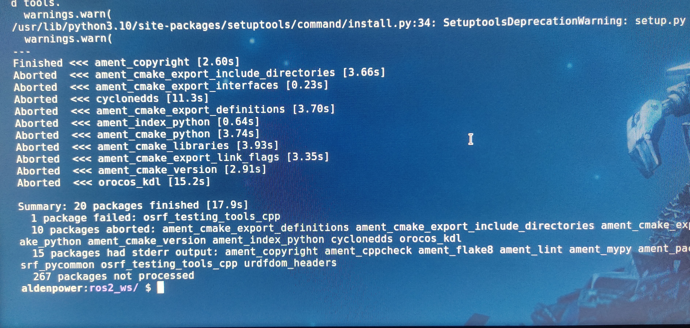
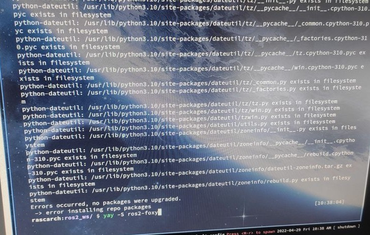

No processo de aprendizado e de desenvolvimento em robótica, torna-se necessário o domínio de sistemas operacionais e de ferramentas como ***ROS***, dessa forma, explorar novos ambientes contribuem ativamente na formação do pesquisador.

Irei relatar brevemente a experiência adquirida com a tentativa de instalar o **ROS2** em um sistema ***Arch linux*** ...

### O sistema operacional

{:.center}

{:.center}
Arch Linux

O ***Arch Linux*** é uma distribuição ***GNU/Linux*** de uso geral empenhada no fornecimento das últimas versões estáveis, o **Arch Linux** segue o modelo _rolling release_, ou seja, um sistema que se encontra em constante desenvolvimento.

A ponto positivo do modelo ***rolling release*** é estar sempre a frente e acompanhando o desenvolvimento das novas versões de software, saber lidar com um sistema que pode ser instável mas que se encontra com as últimas versões explora a capacidade  de adaptação do pesquisador, em termos de aprendizado isso traz bastante valor.

> Antes de relatar a experiência com a instalação em si, vale a pena falar um pouco sobre o sistema de instalação de pacotes do **Arch Linux**

- ***pacman (package manager)***:
Gerenciador de pacotes do **Arch Linux**, a meta do pacman é tornar o gerenciamente de pacote algo simples, ele mantém o sistema atualizado com o servidor mestre.

- ***AUR***: É um repositório dirigido pela comunidade **Arch Linux**, foi criado para organizar e compartilhar novos pacotes da comunidade.

### Processo de instalação do **ROS2**

Na [documentacao oficial](https://docs.ros.org/en/humble/Installation.html) para instalacao do ROS2 não existe suporte para a instalacão em sistemas ***Arch Linux***, portanto optei pela tentativa de instalar as dependências para instalação do ROS2 por meio do pacote [**ros2-arch-deps**](https://aur.archlinux.org/packages/ros2-arch-deps) (AUR) e posteriormente fazer o processo de ***building from source*** sugerido pela documentação do [**Arch Linux**](https://wiki.archlinux.org/title/ROS).

O processo de **build** gerou alguns erros ocasionando em falha no processo de instalação...

{:.center}

Após testar o processo sugeridos pela documentação do **Arch Linux**, procurei alguns pacotes ***AUR*** que fazem a instalação completa do ROS2 e não obtive sucesso ...

{:.center}

### Conclusão 

A instalação do **ROS2** não foi concluída no **Arch Linux**, fazer uma investigação mais aprofundada a respeito do processo de ***build*** do **ROS2** são planos para o futuro, irei invetigar melhor a possibilidade de econtrar novos pacotes **AUR** ou verificar o motivo do processo de ***build*** estar falhando.

<!-- autor -->

<h3 class="post-title">Autor</h3> 

  

    <table class="table-borderless highlight">
      <thead>
        <tr>
          <th></th>
        </tr>
      </thead>
      <tbody>
        <tr class="font-weight-bolder" style="text-align: center margin-top: 0">
          <td>Anderson Lima</td>
        </tr>
        <tr style="text-align: center" >
          <td style="color: #808080; vertical-align: top; text-align: justify"><small>Pesquisador em Robótica no Centro de Competências em Robótica e Sistemas Autônomos do Senai Cimatec. Anderson é formado em engenharia civil. Exerce atualmente a função de pai 24 horas.</small></td>
          <td></td>
        </tr>
      </tbody>
    </table>
  

 